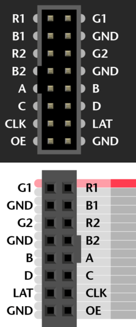

# LED Sandbox
LED Sandbox

This project has the main goal to create a physic's driven colorful sand animation using a led matrix and Terasic DE10-lite.
The animation is based on DE10 accelerometer or gestures captured via D8M camera and elaborated by a small neural network.
The animation is displayed in a led matrix.

We use a SOPC approach with hardware periferial driver and sw for physics elaborations.

# Periferial PINOUT

## LED Matrix

Matrix pin a partire da quello con la fascia rossa.



| name |  Matrix PIN  |   Board PIN    |           Description                           |
| ---- | ------------ |   ---------    |     ------------------------                    |
|  R1  |      1       | ARDUINO_IO[0]  | RED led upper Sub-matrix                        |
|  G1  |      2       | ARDUINO_IO[1]  | GREEN led upper Sub-matrix                      |
|  B1  |      3       | ARDUINO_IO[2]  | BLUE led upper Sub-matrix                       |
|  GND |      4       | GND            | ground                                          |
|  R2  |      5       | ARDUINO_IO[3]  | RED led lower Sub-matrix                        |
|  G2  |      6       | ARDUINO_IO[4]  | GREEN led lower Sub-matrix                      |
|  B2  |      7       | ARDUINO_IO[5]  | BLUE led lower Sub-matrix                       |
|  GND |      8       | GND            | ground                                          |
|  A   |      9       | ARDUINO_IO[6]  | Select which column you are driving             |
|  B   |      10      | ARDUINO_IO[7]  | Select which column you are driving             |
|  C   |      11      | ARDUINO_IO[8]  | Select which column you are driving             |
|  D   |      12      | ARDUINO_IO[9]  | Select which column you are driving             |
|  CLK |      13      | ARDUINO_IO[10] | Clock for led visualization                     |
|  LAT |      14      | ARDUINO_IO[11] | Latches the value until put low                 |
|  OE  |      15      | ARDUINO_IO[12] | Output enable. High until all led values loaded |
|  GND |      16      | GND            | ground                                          |

## Submodules

The physical engine used to animate the pixels of the RGB matrix is taken from the Adafruit library.
You'll need to checkout the required submodules:

```
git submodule update --init --recursive
```


## POSIX Emulator

First, move to this directory, create a Python virtual environment (`python>=3.10`) and installed
the required PIP packages:

```
python -m venv .
source ./bin/activate
pip install -r requirements.txt
```

To compile the POSIX OS compatible emulator, you'll need `meson` installed:

```
sudo apt install meson
```

Then move to `software/led_sandbox/led_sandbox_posix` and setup the meson build environment

```
meson setup build
```

and compile the project

```
meson compile -C build
```

Once you've done that, you can start the main process that emulates the code executed on the NIOS II
processor

```
./led_sandbox
```

and then you can open another terminal (still with the python virtual environment activated), move
to `software/led_sandbox/led_sandbox_posix/rgb_led_matrix_emulator` and start the Python-based RGB LED
matrix emulator with the following

```
python rgb_led_matrix_emulator.py
```

You can now open a web browser at the address `localhost:8888` and see the emulated matrix.
To control the NIOS II emulated software you can use your keyboard:
- `a`: reset push-button
- `s`: step-forward push-button
- `0-9`: slider switches
- `x/X`: decrease/increase X-axis acceleration
- `y/Y`: decrease/increase Y-axis acceleration
- `z/Z`: decrease/increase Z-axis acceleration

